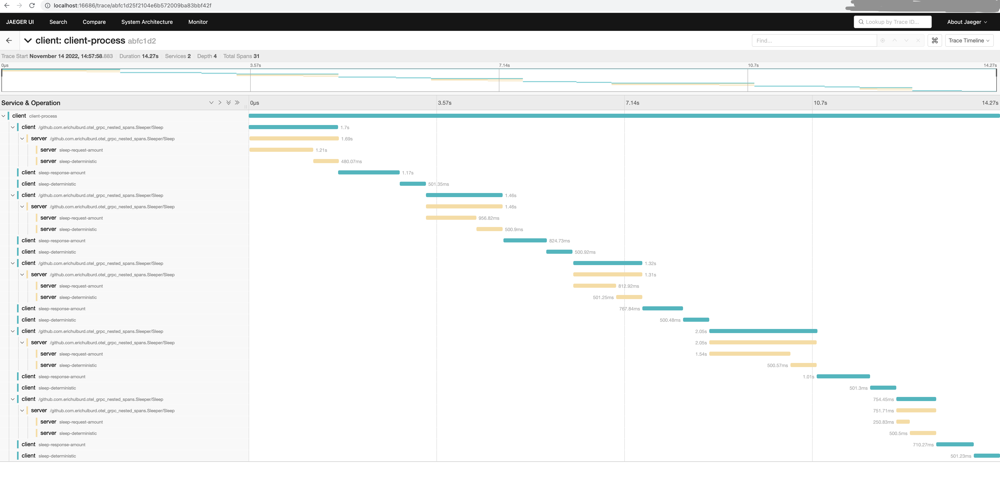

A simple demo illustrating OpenTelemetry using gRPC asyncio client and server. Everything worked out of the box as is. This uses:

* [The Jaeger OTel exporter](https://github.com/open-telemetry/opentelemetry-specification/blob/main/specification/sdk-environment-variables.md#jaeger-exporter)
* [Jaeger all-in-one Docker image](https://www.jaegertracing.io/docs/1.39/getting-started/)
* [OTel instrumentation gRPC for Python](https://github.com/open-telemetry/opentelemetry-python-contrib/tree/main/instrumentation/opentelemetry-instrumentation-grpc)

Run the server and client:

```shell script
docker compose up --build
```

Lookup [service="client" and operation="client-process"](http://localhost:16686/search?limit=20&lookback=1h&maxDuration&minDuration&operation=client-process&service=client) in the Jaeger UI. You should see one neat span containing 5 gRPCs from the client to the server, each interspersed with a random (sent from server) and deterministic sleep interval. Each server span will likewise include a random (sent from client) and deterministic sleep interval.

Your trace should look similar to the below trace:

